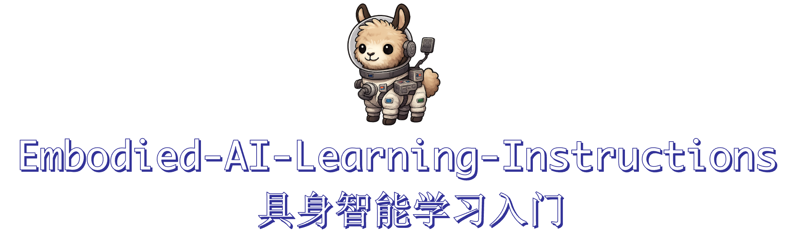

  

  <h1>具身智能入门 Embodied-AI-Learning—Instructions</h1>

本仓库主要是为了具身智能领域完全的新手入门所整理的学习资料和个人笔记心得，主要为了本人以后查阅相关资料以及为初学者提供相关的指南，希望能够帮到更多人。

<section id="start"></section>

## 具身智能的定义与相关的类别划分

> **定义**：Embodied AI 是指让智能体（agent）在具备“身体”的情况下与真实或虚拟环境交互，通过感知、行动和反馈来学习智能行为。  
> 它融合了计算机视觉、自然语言处理、机器人学、强化学习、多模态理解等多个方向。具体领域划分请见下表。

---

| 领域类别 | 典型任务 | 代表平台 / 模型 | 关键挑战 |
|-----------|-----------|-----------------|-----------|
|  **机器人与具身智能体** | 家用机器人、服务机器人、任务执行（如取物、清洁） | RoboGPT, SayCan, PaLM-E, RT-2 | 语言到动作的映射、安全约束、物理执行可靠性 |
|  **视觉导航与交互 (Embodied Navigation)** | 视觉-语言导航（VLN）、目标导航（ObjectNav, ImageNav） | Habitat, Matterport3D, Gibson, AI2-THOR | 空间理解、跨环境泛化、语言指令解析 |
|  **具身操作 (Embodied Manipulation)** | 抓取、旋转、开门、组装、烹饪等复杂操作 | RLBench, ManiSkill, Isaac Gym, Habitat 3.0 | 高维控制、视觉-动作对齐、Sim2Real 迁移 |
|  **虚拟世界与仿真环境学习** | 在3D环境中学习任务规划与交互 | ProcTHOR, VirtualHome, BEHAVIOR, iGibson | 逼真物理仿真、任务分解与泛化 |
|  **具身认知与学习 (Cognitive Embodied AI)** | 物理推理、社会行为学习、因果理解 | IntPhys, SocialGym, BabyAI | 具身推理建模、跨模态记忆、抽象概念形成 |
|  **语言-行动对齐 (Language-Action Alignment)** | 自然语言控制机器人、代码生成 | SayCan, Code-as-Policies, See-Say-Do | 指令语义 grounding、规划与动作生成一致性 |
|  **工具与评测生态 (Benchmarks & Tools)** | 多任务综合评测、通用智能体评估 | ALFRED, BEHAVIOR, EAI Leaderboard | 统一指标、任务复杂性、多模态能力评估 |
|  **新兴方向 (Emerging Directions)** | Embodied Foundation Models, 数字孪生、社会具身AI、AR/VR智能体 | PaLM-E, RT-X, VILA, GPT-4V, Metaverse Agents | 现实迁移、能耗与计算成本、伦理与安全性 |

---

## 如何进行入门

感谢Jiyao哥提供给初学者的[具身初学者所需要具备的技能](./assets/For_Beginners.pdf),因此在入门过程中按照深度学习(deep learning),机器人学(Robotics)以及3D视觉(3DVISION)进行入门，在本仓库不同的类别下分别包含着与该领域相关的学习资料和内容，比如说，cs231n作为入门计算机视觉深度学习的良好学习材料，我在这里对于课程中的内容形成了笔记记录，并且完成了相应的assignments，所有的代码和笔记都在*Deep_learning*文件夹下，同理其余学习资料也会按照类别和内容整理在相应的类别下。

## 具身领域相关的信息
在这里特别感谢[具身智能学习指南](https://github.com/TianxingChen/Embodied-AI-Guide)所收集到的非常详细的从学习到工作以及社群的丰富信息，可以快速为初学者消除信息差，以下的内容是经过本人筛选并且结合实用性所总结

* 社交媒体:

  * 可以关注的公众号: **石麻日记 (超高质量!!!)**, 机器之心, 新智元, 量子位, Xbot具身知识库, 具身智能之心, 自动驾驶之心, 3D视觉工坊

  * AI领域值得关注的博主列表 [3]: [zhihu](https://zhuanlan.zhihu.com/p/682110383)

* 具身智能会投稿的较高质量会议与期刊：Science Robotics, TRO, IJRR, JFR, RSS, IROS, ICRA, ICCV, ECCV, ICML, CVPR, NeurIPS, ICLR, AAAI, ACL等。

* Awesome-Embodied-AI-Job (具身智能招贤榜): [Repo](https://github.com/StarCycle/Awesome-Embodied-AI-Job/tree/main)
  
* 社区:
  * DeepTimber Robotics Innovations Community, 深木科研交流社区: [website](https://gamma.app/public/DeepTimber-Robotics-Innovations-Community-A-Community-for-Multi-m-og0uv8mswl1a3q7?mode=doc)
  * 宇树具身智能社群: [website](https://www.unifolm.com/#/)
  * Simulately: Handy information and resources for physics simulators for robot learning research: [website](https://simulately.wiki/)
  * DeepTimber-地瓜机器人社区: [website](https://developer.d-robotics.cc/forumList?id=156&title=Deeptimber)
  * HuggingFace LeRobot (Europe, check the Discord): [website](https://github.com/huggingface/lerobot)
  * K-scale labs (US, check the Discord): [website](https://kscale.dev/)
 
## 算法与相关知识

> 以下为具身的有关算法总览表。

| 小节 | 主题 | 作用/目标 | 关键点 | 代表示例/链接 |
|---|---|---|---|---|
| 3.1 | 常用工具 | 提升3D/机器人实践效率 | 点云降采样（随机/均匀/最远点/法线空间） 手眼标定（眼在手上/手外） | 降采样：[知乎](https://zhuanlan.zhihu.com/p/558683732)；手眼标定：[GitHub](https://github.com/fishros/handeye-calib) |
| 3.2 | 视觉基础模型 | 直接赋能下游任务（检测/分割/深度/特征） | CLIP/DINO/SAM/SAM2/Grounding-DINO/OmDet-Turbo FoundationPose/Depth Anything/Point Transformer v3/RDT-1B/SigLIP/Stable Diffusion | CLIP：[GitHub](https://github.com/openai/CLIP)；DINOv2：[GitHub](https://github.com/facebookresearch/dinov2)；SAM：[官网](https://segment-anything.com/)；Grounding-DINO：[GitHub](https://github.com/IDEA-Research/GroundingDINO) |
| 3.3 | 机器人学习 | 感知-决策-控制全链路 | 课程（ETH/TTIC/UdeM、MILA、CMU、USC、MIT） MPC（显式/非线性/鲁棒/学习增强） RL（PPO/SAC/TRPO/A3C）；IL（教程/实操） | Duckietown：[课程](https://www.edx.org/learn/technology/eth-zurich-self-driving-cars-with-duckietown)；CS285：[网站](https://rail.eecs.berkeley.edu/deeprlcourse/)；MPC综述：[Survey](https://www.sciencedirect.com/science/article/abs/pii/0005109889900022) |
| 3.4 | LLM for Robotics | 利用LLM做规划/代码策略/与规划器结合 | 高层规划：PaLM-E/EmbodiedGPT 等 统一高低层：RT-2 LLM+Planner：LLM+P/AutoTAMP Code as Policy/Instruction2Act | PaLM-E：[ArXiv](https://arxiv.org/abs/2303.03378)；RT-2：[Page](https://robotics-transformer2.github.io/) |
| 3.5 | VLA 模型 | 端到端视-语-动（动作token化） | 自回归：RT系/RoboFlamingo/OpenVLA/Tiny/TraceVLA 扩散动作头：Octo/π0/CogACT/Diffusion-VLA 3D融合：3D-VLA/SpatialVLA 产业与最新：GR00T-N1/Helix/pi-0.5/Hi-Robot 等 | OpenVLA：[GitHub](https://github.com/openvla)；Octo：[Page](https://octo-models.github.io/)；GR00T-N1：[GitHub](https://github.com/NVIDIA/Isaac-GR00T) |
| 3.6 | 计算机视觉 | 2D/3D/4D 基础与生成 | 2D：CNN/ResNet/ViT/Swin；生成：自回归/扩散综述 3D：Geiger 课、GAMES203、3D生成索引 4D：视频理解/4D生成综述与列表 | CS231n：[网站](https://cs231n.stanford.edu/schedule.html)；扩散综述：[PDF](https://arxiv.org/pdf/2209.00796) |
| 3.6.4 | 视觉提示 | 视觉线索→零样本任务适应 | 综述；PIVOT；SOM-GPT4V | 综述：[ArXiv](https://arxiv.org/abs/2409.15310)；PIVOT：[Page](https://pivot-prompt.github.io) |
| 3.6.5 | 可供性锚定 | 从感知到可交互区域定位 | 2D：Cross-View-AG/AffordanceLLM/AGD20K 3D：OpenAD/Where2Act/VAT-Mart/DeformableAffordance/SceneFun3D | Where2Act：[ArXiv](https://arxiv.org/abs/2101.02692)；SceneFun3D：[Page](https://scenefun3d.github.io/) |
| 3.7 | 计算机图形学 | 渲染/仿真（NeRF/3DGS/并行） | GAMES101/202/105；NeRF/3DGS原理课 3D预训练综述；3DGS在机器人综述 | GAMES101：[网站](https://games-cn.org/intro-graphics/)；3DGS综述：[ArXiv](https://arxiv.org/pdf/2410.12262v2) |
| 3.8 | 多模态模型 | 融合视觉×语言（VLM/生成/强化） | CLIP、LLaVA、多模态生成综述 VLM-R1（GRPO 强化多模态） | LLaVA：[Site](https://llava-vl.github.io/)；VLM-R1：[GitHub](https://github.com/om-ai-lab/VLM-R1) |
| 3.9 | 机器人导航 | 目标/图像/语语导航；端到端/模块化/零样本 | 模块化：建图/全局/局部策略；零样本：CLIP/LLM先验 代表：SemExp、PONI、3D-Aware、CoWs、L3MVN、ESC、SG-Nav 数据集：MP3D/HM3D、RoboTHOR | SG-Nav：[ArXiv](https://arxiv.org/abs/2410.08189)；MP3D：[网站](https://niessner.github.io/Matterport/) |

> 以下为现有的视觉基础模型。

| 模型 | 核心用途 | 典型场景 | 链接 |
|---|---|---|---|
| CLIP / SigLIP | 图文对齐/检索/先验 | 零样本检测/导航/物体检索 | [CLIP](https://github.com/openai/CLIP) · [SigLIP](https://huggingface.co/docs/transformers/en/model_doc/siglip) |
| DINO / DINOv2 | 强视觉特征/对应关系 | 匹配/跟踪/多视几何先验 | [DINOv2](https://github.com/facebookresearch/dinov2) |
| SAM / SAM2 | 分割 / 视频跟踪分割 | 交互式标注/视频级实例跟踪 | [SAM](https://segment-anything.com/) · [SAM2](https://ai.meta.com/sam2/) |
| Grounding-DINO | 文本引导检测（OVD） | 开放词表目标检测 | [GitHub](https://github.com/IDEA-Research/GroundingDINO) |
| OmDet-Turbo | 极速开放词表检测 | 高FPS实时检测 | [GitHub](https://github.com/om-ai-lab/OmDet) |
| Grounded-SAM | 检测+分割一体 | 一次性定位并分割目标 | [GitHub](https://github.com/IDEA-Research/Grounded-SAM-2) |
| Depth Anything v1/v2 | 单目深度估计 | 3D重建/导航/操控几何先验 | [v1](https://github.com/LiheYoung/Depth-Anything) · [v2](https://github.com/DepthAnything/Depth-Anything-V2) |
| Point Transformer v3 | 点云特征提取 | 3D理解/几何检测 | [GitHub](https://github.com/Pointcept/PointTransformerV3) |
| FoundationPose | 物体位姿跟踪 | 操控/抓取/放置 | [GitHub](https://github.com/NVlabs/FoundationPose) |
| RDT-1B | 双臂操作基础模型 | 少样本操控 | [Page](https://rdt-robotics.github.io/rdt-robotics/) |
| Stable Diffusion | 生成/先验&目标图 | 生成目标状态/数据增强 | [GitHub](https://github.com/CompVis/stable-diffusion) |

## 具身智能（Embodied AI）主要数据集与平台汇总
> 以下为近年具身智能领域的重要开源数据集和仿真平台，涵盖真实机器人、仿真环境、多模态感知与语言对齐等方向。

| 数据集 / 平台 | 时间 / 会议 | 来源 / 链接 | 核心内容与特征 |
|----------------|--------------|---------------|----------------|
| **Open X-Embodiment** | — | [Website](https://robotics-transformer-x.github.io/) | 包含 22 种不同机器人平台的超过 **100 万条真实轨迹数据**，覆盖 **527 种技能** 和 **160,266 项任务**，主要集中在抓取与放置任务。 |
| **AgiBot World Datasets (智元机器人)** | — | [Website](https://agibot-world.com/) | 拥有 **80+ 种日常技能**、**100 万+ 轨迹数据**，来自同构型机器人，具备多级质量控制与人工在环采集流程，数据质量极高。 |
| **RoboMIND** | — | [Website](https://x-humanoid-robomind.github.io/) | 含 **10.7 万条真实演示轨迹**，覆盖 96 类物体与 479 种任务，来自 4 种协作臂，任务分为：基础技能、精准操作、场景理解、柜体操作、协作任务五类。 |
| **All Robots in One (ARIO)** | — | [Website](https://imaei.github.io/project_pages/ario/) | 提供 **2D、3D、文本、触觉、声音** 五模态感知数据，涵盖 **操作与导航** 两大任务，含仿真与真实数据，规模达 **300 万条**，格式统一、硬件多样。 |
| **MimicGen** | 26 Oct 2023, CoRL 2023 | [Repo](https://github.com/NVlabs/mimicgen) / [Website](https://mimicgen.github.io/) | 基于 Robosuite 与 MuJoCo 的高效数据生成框架，聚焦单臂桌面操作。通过 **200 段真人演示生成 5 万条仿真数据**，覆盖 18 类常见任务。 |
| **RoboCasa** | 4 Jun 2024 | [Repo](https://github.com/robocasa/robocasa) / [Website](https://robocasa.ai/) | 基于 RoboSuite 与 MimicGen 的高仿真厨房任务平台，含 **120 个厨房环境**、**2500+ 物体模型**、**25 种基础任务 + 75 种组合任务**，支持单臂、双臂、人形及移动机器人系统。 |
| **DexMimicGen** | 6 Mar 2025, ICRA 2025 | [Repo](https://github.com/NVlabs/dexmimicgen/) / [Website](https://dexmimicgen.github.io/) | 以 RoboSuite + MimicGen 构建的高保真双臂仿真环境，含 9 类典型双臂任务，仅用 **60 段真实演示生成 2.1 万条仿真数据**，支持 real2sim2real 自适应生成。 |
| **FUSE Dataset** | ICRA 2025 | [Website](https://fuse-model.github.io/) | 包含 **26,866 条远程操控轨迹**，涉及桌面抓取、购物袋内抓取、按钮按压任务。通过 VR 操控采集，结合语言指令与复杂视觉遮挡，支持多模态策略研究。 |
| **BiPlay Dataset** | — | [Website](https://dit-policy.github.io/) | 专注双臂操作泛化研究，采用随机物体与背景，包含 **7023 个语言标注剪辑**（约 10 小时视频），支持双臂操作与任务多样性研究。 |
| **DROID (Distributed Robot Interaction Dataset)** | — | [Website](https://droid-dataset.github.io/) | 含 **76,000 条示范轨迹 / 350 小时数据**，覆盖 **564 场景、86 任务**，由 50 名采集员在三大洲采集，任务多样性与鲁棒性强。 |
| **BridgeData V2** | — | [Website](https://rail-berkeley.github.io/bridgedata/) | 含 **60,096 条轨迹**（24 环境、13 技能），支持基于图像或语言的多任务学习；含 **50,365 条远程演示 + 9731 条脚本策略执行**，每条轨迹均含自然语言描述。 |
| **Ego4DSounds** | — | [Website](https://ego4dsounds.github.io/) | Ego4D 子集，包含 **120 万+ 视频剪辑**，覆盖 3000+ 日常场景（烹饪、清洁、购物、社交等），强调 **动作与环境声音对齐**，支持声音-动作多模态研究。 |
| **RH20T** | — | [Website](https://rh20t.github.io/) | 大规模人机交互数据集，约 **40TB 原始数据（含 RGB / RGB-D / 深度 / 音频）**，含面部与语音信息，附带相机标定与机器人关节数据，提供 5TB 精简版下载。 |

---

## Benchmarks基准集
| Benchmark | 年份 | 主要关注点 | 链接 | 简介 |
|------------|------|-------------|------|------|
| **CALVIN** | 2022 | 多模态输入、自然语言控制、长程规划 | [GitHub](https://github.com/mees/calvin) · [Website](http://calvin.cs.uni-freiburg.de/) | 结合语言控制、高维视觉输入与 7 自由度机械臂的长时序操纵 benchmark，用于评估具身智能模型的多模态与规划能力。 |
| **Meta-World** | — | 元强化学习、多任务泛化 | [Website](https://meta-world.github.io/) | 含 50 个机器人任务，支持 ML1、ML10、ML45、MT10、MT50 等集合，测试 RL agent 的多任务与泛化能力，基于 Mujoco。 |
| **Embodied Agent Interface** | 2023 | LLM 决策评估 | [Website](https://embodied-agent-interface.github.io/) | 评估大型语言模型在具身决策中的推理、任务分解与动作建模能力，不涉及执行控制。 |
| **RoboGen** | 2023 | 数据与任务生成 | [Repo](https://github.com/Genesis-Embodied-AI/RoboGen) · [Website](https://robogen-ai.github.io/) | 通过程序化生成器生成具身任务、场景与带标签数据，可用于监督训练与评测。 |
| **LIBERO** | 2024 | 程序化任务生成、终身学习 | [Repo](https://github.com/Lifelong-Robot-Learning/LIBERO) · [Website](https://libero-project.github.io/intro.html) | 可生成无限任务，内置 RNN/Transformer/ViLT 网络与多种持续学习算法，适用于顺序微调与多任务训练。 |
| **RoboTwin** | 2024 | 双臂操作与多任务评测 | [Repo](https://github.com/TianxingChen/RoboTwin) | 使用程序生成双臂机器人任务数据，提供多任务统一评测标准。 |

